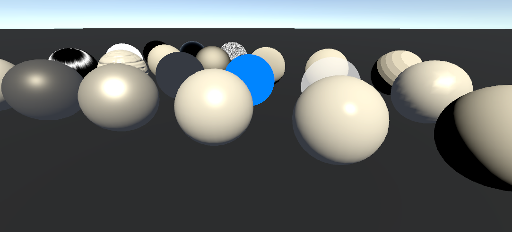

# URPShaderCodeSample

Unity URP Shader 代码示例使用 Unity 2020.3.18f1c1 以及 Universal RP 10.6.0 编写和测试

# 简介

   自学过程中发现大量的资料要么是代码段，要么是Unity 的build-in shader的实现，而URP自带的shader被封装的太深，keywords又太多不方便学习。我想要一些简单纯粹的URP自定义Shader的实现，所以我为了方便学习和作为其他URP Shader编写的参考，写了一系列常见shader代码。

​        因为并不是为了创建自己的shader库或者直接使用而写的所以代码没有优化，而是以方便阅读和学习的方式书写。

​        小总结：https://www.bilibili.com/video/BV1qP4y1h7CB/

*补充：我本来是想 Shader Graph撸一切的，但是后来随着复杂度的提升，我发现 Shader Graph受到的限制越来越多，所以还是不得不学习URP中 Shader的写法*

*注意：很多复杂的 shader文件，我在顶部和使用处添加了可供参考的注释*

## 内容列表

##### Base

Texture、Color、Transparent、AlphaTest、Fog、Fresnel、Noise、UVCheck、NormalCheck、TangentCheck、BitangentCheck、VertexColor、VertexAnimation、TextureScrollUV、TextureScreenSpace

##### Lighting

Ambient、Anisotropic (Hair)、BackLight、Blinn-Phong Lighting、Blinn-Phong Specular、Phong Ligting、Phong Specular、Gouraud Lighting、BumpMap (Normal Map)、Lambert、Half-Lambert、Wrap、Lightmap、LightProbe、ReflectionProbe、Refraction、Minnaert、Oren-Nayer、Multi-Lighting、Shadow、ReceiveShadow、PBR Common、PBR In Unity URP、MatCap、ParallaxMapping、ParallaxMapping (Self-Shadowing)

##### Effect

Fractal (Mandelbrot)、InteriorMapping (Cubemap)、InteriorMapping (Pre-Projected)

##### NPR

###### Cartoon

Cel Shading (Ramp)、Cel Shading (Ramp Specular)、Cel Shading (Ramp Fresnel)、Cel Shading (Procedural)、Tone Based Shading、Outline (Rim)、Outline (Z-Bias)、Outline (Shell Method)

###### Edge Detection

Edge Detection Color、Edge Detection Depth、Edge Detection DepthNormal

##### Tools

Capture Screenshot 、Outline Smooth Normals Tool

## 参考资料

Unity URP 官方文档 [https://docs.unity3d.com/Packages/com.unity.render-pipelines.universal@8.1/manual/InstallingAndConfiguringURP.html](https://docs.unity3d.com/Packages/com.unity.render-pipelines.universal@8.1/manual/InstallingAndConfiguringURP.html)

自定义URP Shader 官方文档 [https://docs.unity3d.com/Packages/com.unity.render-pipelines.universal@10.2/manual/writing-custom-shaders-urp.html](https://docs.unity3d.com/Packages/com.unity.render-pipelines.universal@10.2/manual/writing-custom-shaders-urp.html)

内置管线Shader升级到URP详细手册 [https://www.jianshu.com/p/3fef69e2efb6](https://www.jianshu.com/p/3fef69e2efb6)

URP 源码梳理 [https://zhuanlan.zhihu.com/p/338786562](https://zhuanlan.zhihu.com/p/338786562)

JD02 常见光照模型总结 [https://zhuanlan.zhihu.com/p/163170973](https://zhuanlan.zhihu.com/p/163170973)

基础光照 [https://learnopengl-cn.github.io/02%20Lighting/02%20Basic%20Lighting/](https://learnopengl-cn.github.io/02%20Lighting/02%20Basic%20Lighting/)

高级光照Blinn-Phone [https://learnopengl-cn.github.io/05%20Advanced%20Lighting/01%20Advanced%20Lighting/](https://learnopengl-cn.github.io/05%20Advanced%20Lighting/01%20Advanced%20Lighting/)

光照模型 PBR [https://zhuanlan.zhihu.com/p/272553650?utm_source=qq](https://zhuanlan.zhihu.com/p/272553650?utm_source=qq)

PBR理论 [https://learnopengl-cn.github.io/07%20PBR/01%20Theory/](https://learnopengl-cn.github.io/07%20PBR/01%20Theory/)

URP管线PBR源码剖析（上） [https://zhuanlan.zhihu.com/p/371395846](https://zhuanlan.zhihu.com/p/371395846)

由浅入深学习PBR的原理和实现 [https://www.cnblogs.com/timlly/p/10631718.html](https://www.cnblogs.com/timlly/p/10631718.html)

深入理解 PBR/基于图像照明 (IBL) [https://zhuanlan.zhihu.com/p/66518450](https://zhuanlan.zhihu.com/p/66518450)

从零开始的卡通渲染 [https://www.zhihu.com/column/c_1215952152252121088](https://www.zhihu.com/column/c_1215952152252121088)
