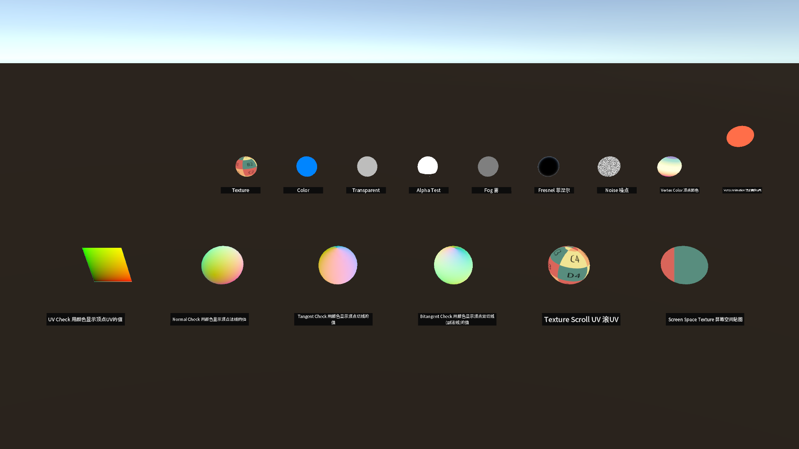
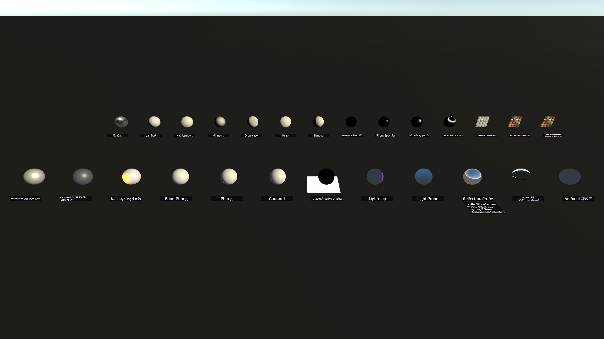
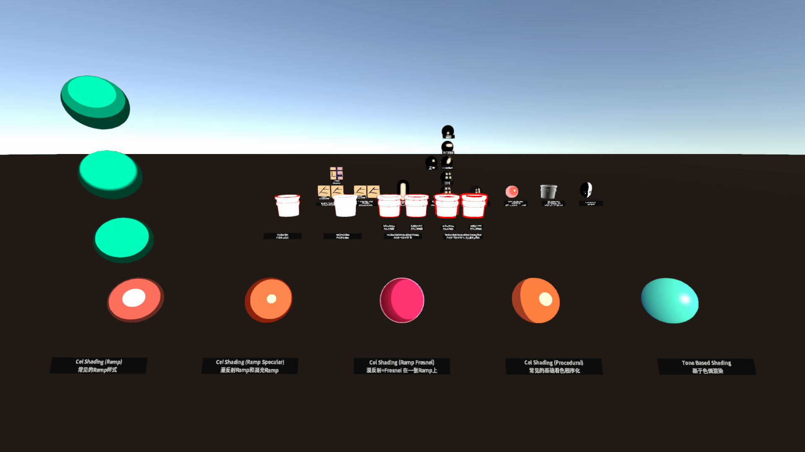
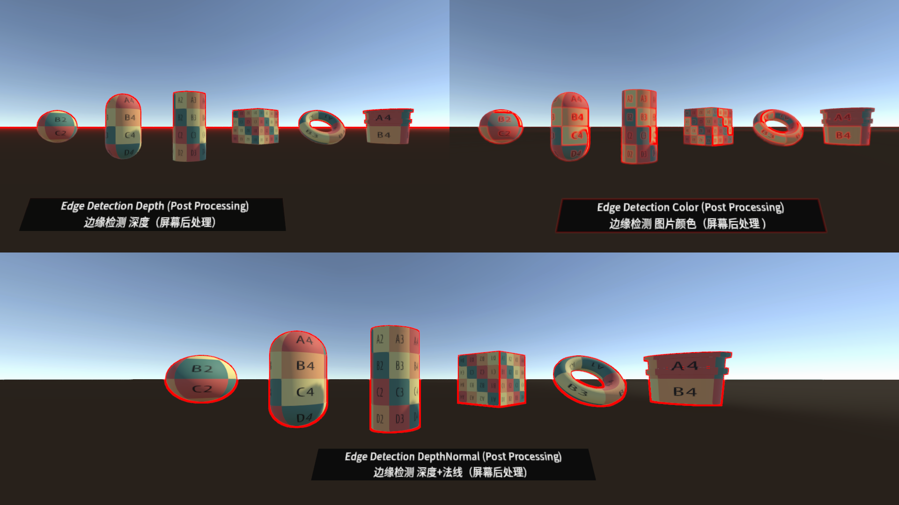
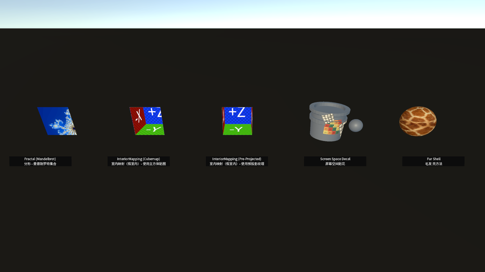

# URPShaderCodeSample

Unity URP Shader 代码示例使用 Unity 2022.3.55f1c1、 Universal RP 14.0.11 、DX、Forward下编写和测试

# 简介

        自学过程中发现大量的资料要么是代码段，要么是Unity 的build-in shader的实现，而URP自带的shader被封装的太深，keywords又太多不方便学习。我想要一些简单纯粹的URP自定义Shader的实现，所以我为了方便学习和作为其他URP Shader编写的参考，写了一系列常见shader代码。

​        因为并不是为了创建自己的shader库或者直接使用而写的所以代码没有优化，而是以方便阅读和学习的方式书写。

*补充：我本来是想 Shader Graph撸一切的，但是后来随着复杂度的提升，我发现 Shader Graph受到的限制越来越多，所以还是不得不学习URP中 Shader的写法*

*注意：很多复杂的 shader文件，我在顶部和使用处添加了可供参考的注释以及参考资料地址*

## 内容列表

##### Base

Texture、Color、Transparent、AlphaTest、Fog、Fresnel、Noise、UVCheck、NormalCheck、TangentCheck、BitangentCheck、VertexColor、VertexAnimation、TextureScrollUV、TextureScreenSpace

##### Lighting

Ambient、Anisotropic (Hair)、BackLight、Blinn-Phong Lighting、Blinn-Phong Specular、Phong Ligting、Phong Specular、Gouraud Lighting、BumpMap (Normal Map)、Lambert、Half-Lambert、Wrap、Lightmap、LightProbe、ReflectionProbe、Refraction、Minnaert、Oren-Nayer、Multi-Lighting、Shadow、ReceiveShadow、PBR Common、PBR In Unity URP、MatCap、ParallaxMapping、ParallaxMapping (Self-Shadowing)

##### Effect

Fractal (Mandelbrot)、InteriorMapping (Cubemap)、InteriorMapping (Pre-Projected)、SimpleDecal(ScreenSpace)、Fur Shell

##### NPR

###### Cartoon

Cel Shading (Ramp)、Cel Shading (Ramp Specular)、Cel Shading (Ramp Fresnel)、Cel Shading (Procedural)、Tone Based Shading、Outline (Rim)、Outline (Z-Bias)、Outline (Shell Method)、Inner Line (BenCunXian)、Inner Line (Distance Field)、Stylized Highlight (Clear Coat)、Stylized Highlight (Transform)、Stylized Highlight (Texture)、Stylized Highlight (Spread)、Rimlight (Depth Offset)、Face Shadow SDF

###### Edge Detection

Edge Detection Color、Edge Detection Depth、Edge Detection DepthNormal

##### Tools

Capture Screenshot 、Outline Smooth Normals Tool、SDF Generator 2D(工具示例)
